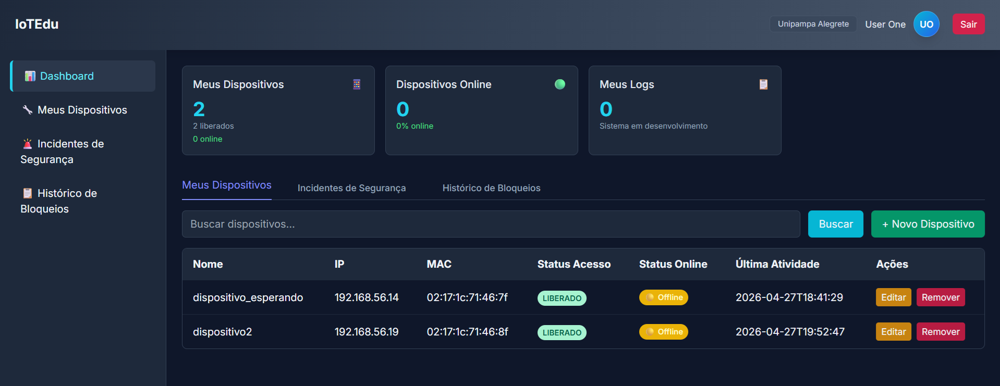
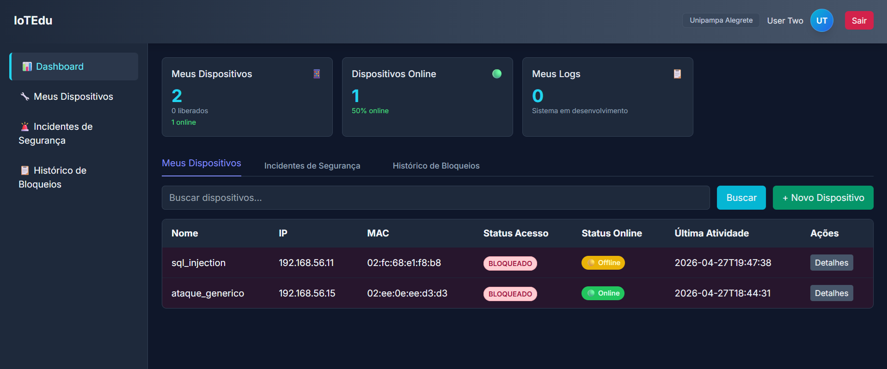
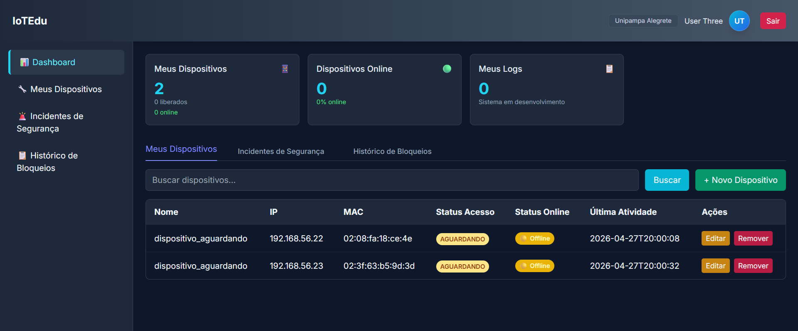
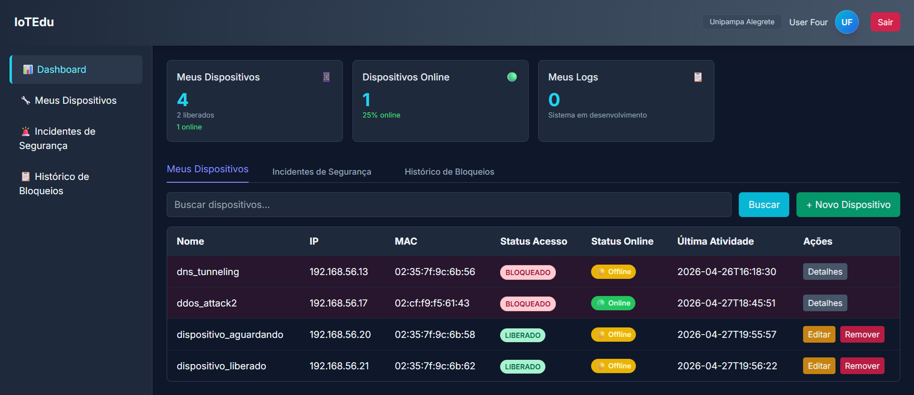

# 🌐 GT IoTEdu — Guia da Demo Online (MVP1)

Este documento é um **passo-a-passo da demo online** da plataforma GT IoTEdu, disponível em [https://mvp.iotedu.org/](https://mvp.iotedu.org/). O objetivo é permitir que qualquer pessoa explore os recursos do MVP a partir de credenciais pré-configuradas, navegando pelos três perfis de acesso e visualizando dados reais de instituições, unidades, dispositivos, alertas de segurança e bloqueios.

> ℹ️ Este **não é** um manual de instalação ou de produção — é um roteiro guiado pela instância de demonstração.

---

## 🔐 Provedores de Identidade e Credenciais da Demo

A demo conta com **dois provedores de identidade (IdP) redundantes**, garantindo que o login permaneça funcional mesmo se um dos provedores estiver indisponível:

| Provedor | URL |
|---|---|
| IdP IoTEdu | `https://idp.iotedu.org` |
| IdP AnonShield | `https://idp.anonshield.org` |

Adicionalmente, a tela de login oferece integração com **CAFe** e **Google**, mas para o fluxo da demo recomendamos os IdPs próprios.

### Usuários pré-configurados

Todos os usuários abaixo compartilham a mesma senha: **`iotedu`**

| Usuário | Perfil | O que você pode explorar |
|---|---|---|
| `superuser@iotedu.org` | **Superadmin** | Gestão global: cadastro de instituições, unidades, todos os usuários do sistema |
| `admin@iotedu.org` | **Admin** | Gestão de uma unidade específica: aprovação/bloqueio de dispositivos, incidentes, aliases pfSense, histórico |
| `user1@iotedu.org` | **User** (comum) | Cadastro e monitoramento dos próprios dispositivos IoT — **apenas com dispositivos LIBERADOS** |
| `user2@iotedu.org` | **User** (comum) | Cadastro e monitoramento dos próprios dispositivos IoT — **apenas com dispositivos BLOQUEADOS** |
| `user3@iotedu.org` | **User** (comum) | Cadastro e monitoramento dos próprios dispositivos IoT — **apenas com dispositivos em estado AGUARDANDO** |
| `user4@iotedu.org` | **User** (comum) | Cadastro e monitoramento dos próprios dispositivos IoT — **dois dispositivos LIBERADOS e dois BLOQUEADOS** |

### 📋 Formato dos Usuários Comuns para Demonstração

> 🧪 Os quatro usuários comuns (`user1`, `user2`, `user3` e `user4`) possuem **especificidades deliberadas** para demonstrar **todos os possíveis estados de um dispositivo** no ciclo de vida do sistema. Cada um exemplifica um cenário diferente:
> 
> - **`user1`** mostra o fluxo de um dispositivo **já liberado** e operacional.
> - **`user2`** exemplifica a experiência de um usuário com dispositivo **bloqueado**, permitindo explorar a transparência de bloqueios.
> - **`user3`** ilustra o estado **Aguardando Aprovação**, mostrando como um dispositivo recém-cadastrado aparece no sistema.
> - **`user4`** combina múltiplos cenários, exibindo dois dispositivos **liberados** e dois **bloqueados**, oferecendo uma visão completa da gestão.
>
> Este design permite validar a interface e fluxos de trabalho para cada estado possível.

A partir desses usuários, é possível acessar diferentes informações já populadas na demo, incluindo:

- Instituição cadastrada (Unipampa)
- Duas unidades configuradas (Alegrete e Bagé), cada uma com seu próprio range de IPs e integrações
- Configurações de rede para cada unidade (pfSense, Zeek, Suricata, Snort)
- Logs e status de dispositivos IoT
- Alertas de ataques simulados (PortScan, SYN Flood, ICMP Tunnel, SQL Injection, brute force, DDoS)
- Histórico de bloqueios administrativos e baseados em feedback

---

## 1. Acesso Inicial

1. Acesse [https://mvp.iotedu.org/](https://mvp.iotedu.org/) — você será recebido pela **Página de Apresentação**.
2. Clique em **Login** no canto superior direito.
3. Na tela de seleção, escolha **"Continuar com IdP IoTEdu"** (ou **"Continuar com IdP AnonShield"** como alternativa redundante).
4. Insira o **Username** e **Password** de um dos perfis listados acima.
5. Clique em **Sign In**.

> 💡 Para experimentar o fluxo completo, recomendamos a seguinte sequência:
> 1. **`superuser`** — explore a criação de instituições e unidades
> 2. **`admin`** — veja a gestão diária: aprovação, bloqueio e incidentes
> 3. **`user1`, `user2`, `user3`, `user4`** — explore cada estado possível de um dispositivo (liberado, bloqueado, aguardando, e combinado)

---

## 2. Perfil Superadmin

> Login: `superuser@iotedu.org` / `iotedu`

O Superadmin tem controle total sobre a plataforma. Use este perfil para entender como instituições e unidades são onboardadas e como os usuários do sistema são gerenciados globalmente.

### 2.1 Dashboard Administrativo — Visão Geral

Ao logar, você cai no **Dashboard Administrativo**, com três abas principais: **Visão Geral**, **Usuários** e **Unidades**.

### 2.2 Gerenciamento de Usuários

Na aba **Usuários**:

- **Filtros rápidos** mostram totais de usuários comuns, gestores e administradores.
- A **lista de usuários** exibe nome, unidade vinculada, cidade, nível de permissão, status e último login.
- **Ações disponíveis:**
  - **Alterar permissão:** promover um `USER` a `ADMIN` (ou rebaixar).
  - **Desativar:** revoga o acesso instantaneamente sem excluir o registro.

### 2.3 Cadastro de Unidades (Instituições)

Na aba **Unidades**, clique em cadastrar nova unidade e preencha:

1. **Informações básicas:** nome (ex: `Unipampa`) e cidade (ex: `Alegrete`).
2. **Configurações pfSense:** URL base e chave de acesso para integração com o firewall.
3. **Configurações Zeek:** URL base e chave de acesso.
4. **Suricata e Snort (opcional):** URLs e API keys para receber alertas em tempo real via SSE.
5. **Range de IPs:** IP inicial e final que pertencem à unidade.
6. Clique em **Cadastrar**.

### 2.4 Visualização de Unidades

Após o cadastro, as unidades aparecem como **cards** mostrando:

- Quantidade de gestores vinculados
- Status (Ativo/Inativo)
- URLs de monitoramento e range de IPs
- Botões para **ativar/desativar**, **editar** e **excluir** a unidade

> 🧪 Na demo, você verá duas unidades já cadastradas: **Alegrete** (range `192.168.56.10 – 192.168.56.50`) e **Bagé** (range `192.168.56.60 – 192.168.56.90`), ambas vinculadas à instituição Unipampa.

---

## 3. Perfil Admin (Administrador de Unidade)

> Login: `admin@iotedu.org` / `iotedu`

O Admin enxerga apenas a unidade à qual está vinculado e é responsável pela operação diária: aprovar dispositivos, responder a incidentes e auditar bloqueios.

### 3.1 Lista de Dispositivos

Tela principal do Admin. Permite monitorar em tempo real os ativos da rede IoT da unidade.

- **Filtros:** por IP, MAC ou status (`Aguardando` / `Liberado` / `Bloqueado`).
- **Status online/offline:** indica quais dispositivos estão transmitindo no momento.
- **Ações:**
  - **Liberar:** aprova um dispositivo aguardando ou desbloqueia um previamente bloqueado.
  - **Bloquear:** revoga o acesso imediatamente, propagando a ordem ao firewall.

> 🧪 Na demo, dispositivos com nomes como `brute_force`, `ddos_attack2`, `dispositivo_liberado` e `dispositivo_aguardando` ilustram os diferentes estados do ciclo de vida.

### 3.2 Mapeamento de Aliases

Automatiza a integração com o pfSense, organizando IPs em grupos lógicos:

- **Autorizados (PASS):** dispositivos com permissão de tráfego.
- **Bloqueados (BLOCK):** dispositivos impedidos de comunicar na rede.
- **Ver detalhes:** lista os IPs de cada alias diretamente do firewall.
- **Adicionar IPs:** insere um ou mais IPs nas listas de aliases.
- **Sincronizar / Recarregar:** força atualização contra o pfSense.

### 3.3 Incidentes de Segurança

Consolida alertas de múltiplos motores de detecção (IDS/IPS).

- **Fontes de dados:** alterne entre **Zeek** (análise de comportamento), **Suricata** ou **Snort** (assinaturas).
- **Análise de alertas:** timestamp, assinatura do ataque, severidade, IP origem/destino, protocolo.
- **Triagem:** filtre por criticidade (`Crítica`, `Alta`, `Média`, `Baixa`).
- **Stream ativo (SSE):** alertas chegam em tempo real.

> 🧪 Exemplos visíveis na demo: `ICMP Tunnel Large Payload` (MEDIUM), `Varredura de portas detectada` (HIGH), `LOCAL SYN Flood Detected` (HIGH).

### 3.4 Histórico de Bloqueios

Trilha de auditoria completa das ações restritivas.

- **Tipos:** bloqueios `Administrativos` (feitos pela equipe) ou baseados em `Feedbacks de Usuários`.
- **Detalhamento:** quem realizou, motivo técnico, notas da equipe.
- **Filtros:** `Todos` / `Administrativos` / `Usuários`.

### 3.5 Minha Rede

Verifica a saúde das integrações da unidade:

- **Health check:** status `Online`/`Offline` das APIs de pfSense, Zeek, Suricata e Snort.
- **Escopo local:** range de IPs da unidade.
- **Editar Rede:** permite ajustar parâmetros sem precisar do Superadmin.

---

## 4. Perfil User (Usuário Comum)

Estudantes e pesquisadores têm autonomia para gerenciar seus próprios dispositivos IoT, do cadastro até a liberação.

### Variações de Usuários Comuns

Existem **quatro contas de usuário comum** pré-configuradas, cada uma demonstrando um estado específico:

#### **user1** — Dispositivos Liberados
> Login: `user1` / `iotedu`

Exemplo de usuário com todos os dispositivos já **aprovados e operacionais**. Ideal para explorar a interface de monitoramento em tempo real.

#### **user2** — Dispositivos Bloqueados
> Login: `user2` / `iotedu`

Exemplo de usuário com todos os dispositivos **bloqueados**. Explore como a transparência de bloqueios funciona: veja o motivo, data e responsável.

#### **user3** — Dispositivos Aguardando Aprovação
> Login: `user3` / `iotedu`

Exemplo de usuário com todos os dispositivos no estado **Aguardando** revisão do Admin. Ilustra o início do ciclo de vida de um dispositivo.

#### **user4** — Dispositivos Múltiplos Estados
> Login: `user4` / `iotedu`

Exemplo de usuário com **dois dispositivos liberados e dois bloqueados**. Oferece uma visão completa da gestão de múltiplos estados simultaneamente.

### 4.1 Ciclo de Vida do Dispositivo

Regardless of the user account, the device lifecycle remains the same:

#### Cadastro de Novo Dispositivo

1. No menu lateral, acesse **Meus Dispositivos** e clique em **+ Novo Dispositivo**.
2. **MAC:** endereço físico (ex: `d5:a3:e1:01:b4:f8`).
3. **CID (Nome):** nome amigável (ex: `Sensor de Umidade`, `Raspberry Pi 4`).
4. **Descrição:** finalidade do dispositivo.
5. Clique em **Salvar**.

> ℹ️ O endereço **IP é atribuído automaticamente** assim que o dispositivo é liberado pelo Admin.

### 4.2 Monitoramento de Status

A coluna **Status Acesso** mostra o ciclo de vida do dispositivo:

- 🟡 **AGUARDANDO** — cadastrado, aguardando revisão do Admin.
- 🟢 **LIBERADO** — aprovado, já trafega na rede.
- 🔴 **BLOQUEADO** — acesso interrompido, manualmente ou por regra automática.

### 4.3 Transparência em Bloqueios

Se um dispositivo for bloqueado, o usuário não fica no escuro:

- Clique em **Detalhes** ao lado do status `BLOQUEADO`.
- Veja o **histórico de feedback**: quem bloqueou, data e motivo.
- Identifique se o bloqueio foi **preventivo** (detecção pelo Zeek/Suricata) ou **administrativo**, facilitando o contato com o suporte da unidade.

---

## 📌 Observações Finais

- A demo é um **ambiente de demonstração** — dados podem ser resetados periodicamente.
- Os dois IdPs (`idp.iotedu.org` e `idp.anonshield.org`) são intercambiáveis: se um falhar, use o outro.
- Para reportar problemas ou sugerir melhorias, abra uma issue no repositório do projeto.
